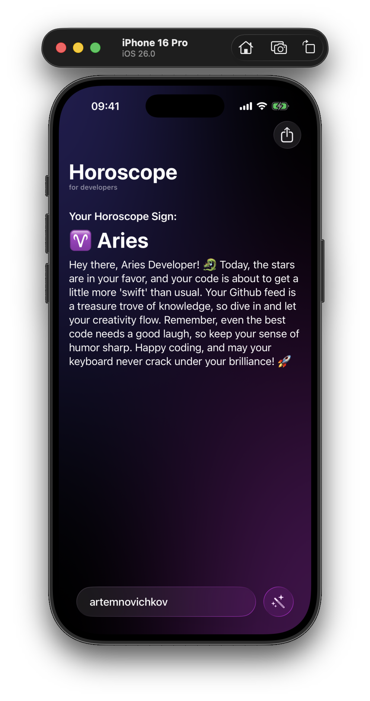
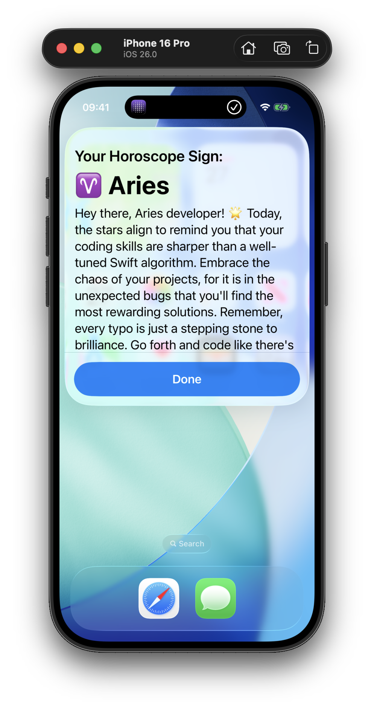
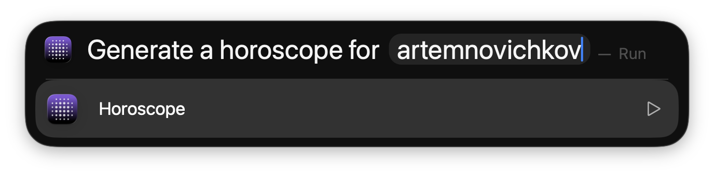
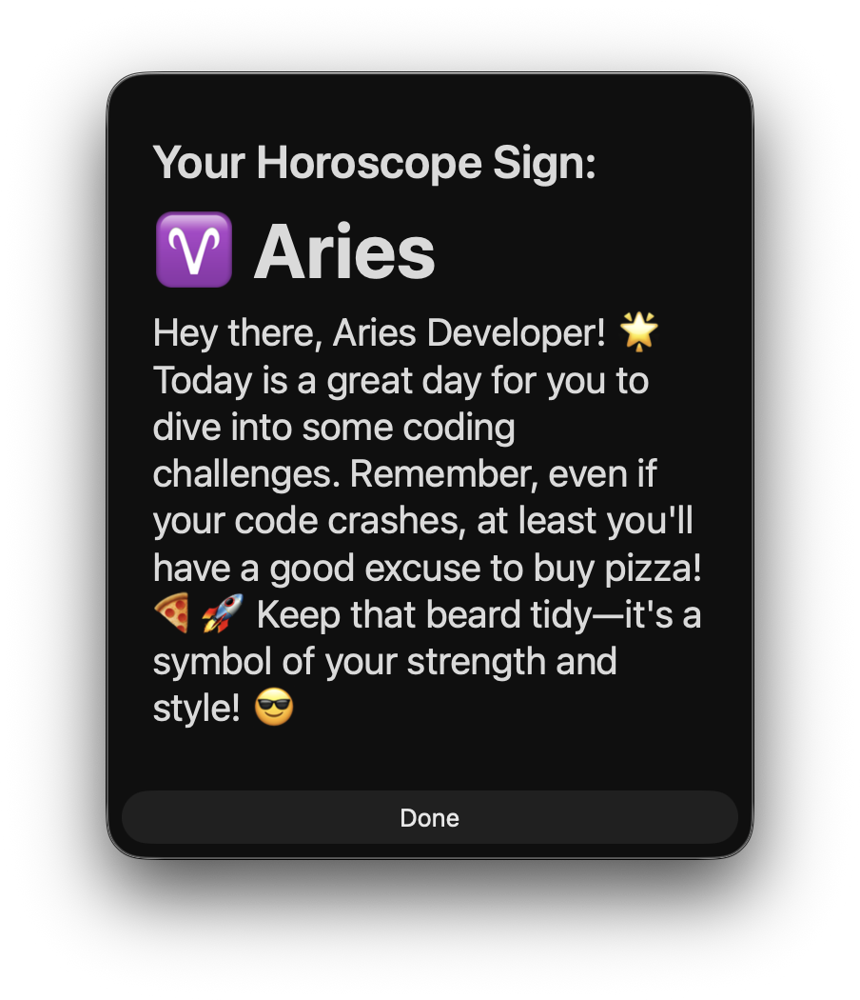

# Developer Horoscope

**Developer Horoscope** creates personalized horoscopes for developers based on their zodiac sign, gender (via Apple Health), and GitHub profile. Simply enter your GitHub username, and enjoy Foundation Models prediction tailored just for you.

## IOS

  
  

## macOS

   
  

## Demo

  <video src="https://github.com/user-attachments/assets/970b4c54-2c13-48dd-97a0-02c3da8a0312" width="80%" />

## Requirements

- Xcode 26.0 beta 4
- iOS 26.0 beta 4 or macOS Tahoe 26.0 beta 4 (for testing in iOS Simulator)

## Author

Artem Novichkov, https://www.artemnovichkov.com/

## License

The project is available under the MIT license. See the [LICENSE](./LICENSE) file for more info.

